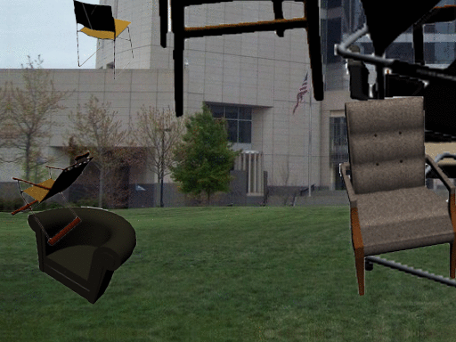
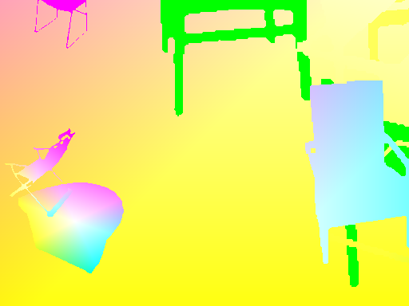
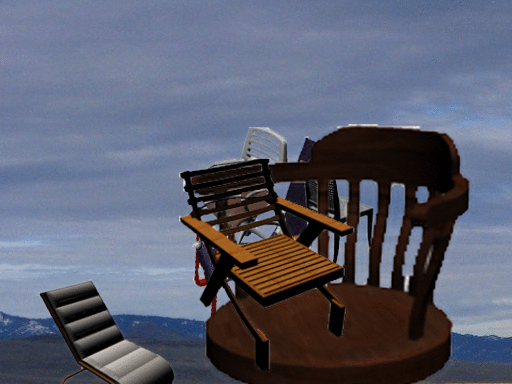
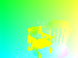
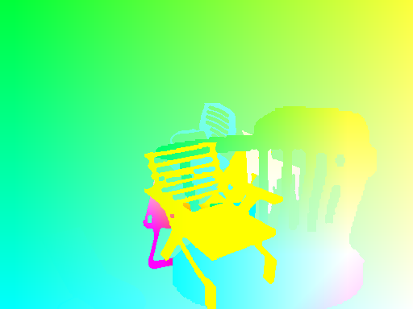
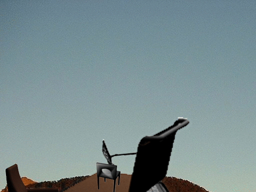
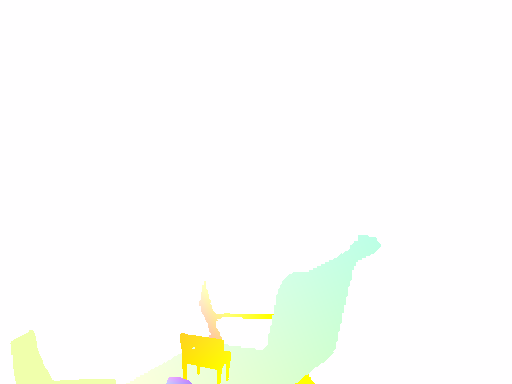

# FlowNetPytorch
Pytorch implementation of FlowNet by Dosovitskiy et al.

This repository is a torch implementation of [FlowNet](http://lmb.informatik.uni-freiburg.de/Publications/2015/DFIB15/), by [Alexey Dosovitskiy](http://lmb.informatik.uni-freiburg.de/people/dosovits/) et al. in PyTorch. See Torch implementation [here](https://github.com/ClementPinard/FlowNetTorch)

This code is mainly inspired from official [imagenet example](https://github.com/pytorch/examples/tree/master/imagenet).
It has not been tested for multiple GPU, but it should work just as in original code.

The code provides a training example, using [the flying chair dataset](http://lmb.informatik.uni-freiburg.de/resources/datasets/FlyingChairs.en.html) , with data augmentation. An implementation for [Scene Flow Datasets](http://lmb.informatik.uni-freiburg.de/resources/datasets/SceneFlowDatasets.en.html) may be added in the future.

Two neural network models are currently provided :

 - **FlowNetS**
 - **FlowNetSBN**
 - **FlowNetC**
 - **FlowNetCBN**

## Pretrained Models
Thanks to [Kaixhin](https://github.com/Kaixhin) you can download a pretrained version of FlowNetS (from caffe, not from pytorch) [here](https://drive.google.com/open?id=0B5EC7HMbyk3CbjFPb0RuODI3NmM). This folder also contains trained networks from scratch.

### Note on networks loading
Directly feed the downloaded Network to the script, you don't need to uncompress it even if your desktop environment tells you so.

### Note on networks from caffe
These networks expect a BGR input in range `[-0.5,0.5]` (compared to RGB in pytorch). However, BGR order is not very important.

## Prerequisite

```
pytorch >= 0.4.1
tensorboard-pytorch
tensorboardX >= 1.4
spatial-correlation-sampler>=0.0.8
imageio
argparse
```

## Training on Flying Chair Dataset

First, you need to download the [the flying chair dataset](http://lmb.informatik.uni-freiburg.de/resources/datasets/FlyingChairs.en.html) . It is ~64GB big and we recommend you put it in a SSD Drive.

Default HyperParameters provided in `main.py` are the same as in the caffe training scripts.

* Example usage for FlowNetS :

```bash
python main.py /path/to/flying_chairs/ -b8 -j8 -a flownets
```

We recommend you set j (number of data threads) to high if you use DataAugmentation as to avoid data loading to slow the training.

For further help you can type

```bash
python main.py -h
```

## Visualizing training
[Tensorboard-pytorch](https://github.com/lanpa/tensorboard-pytorch) is used for logging. To visualize result, simply type

```bash
tensorboard --logdir=/path/to/checkoints
```
	
## Training results

 Models can be downloaded [here](https://drive.google.com/open?id=0B5EC7HMbyk3CbjFPb0RuODI3NmM) in the pytorch folder.
 
 Models were trained with default options unless specified. Color warping was not used.

| Arch        | learning rate | batch size | epoch size | filename                     | validation EPE |
| ----------- | ------------- | ---------- | ---------- | ---------------------------- | -------------- |
| FlowNetS    | 1e-4          | 8          | 2700       | flownets_EPE1.951.pth.tar    | 1.951          |
| FlowNetS BN | 1e-3          | 32         | 695        | flownets_bn_EPE2.459.pth.tar | 2.459          |

*Note* : FlowNetS BN took longer to train and got worse results. It is strongly advised not to you use it for Flying Chairs dataset.

## Validation samples

Prediction are made by FlowNetS.

Exact code for Optical Flow -> Color map can be found [here](main.py#L321)

| Input | prediction | GroundTruth |
|-------|------------|-------------|
|  |  |  |
|  |  |  |
|  |  |  |

## Note on transform functions

In order to have coherent transformations between inputs and target, we must define new transformations that take both input and target, as a new random variable is defined each time a random transformation is called.

### Flow Transformations

To allow data augmentation, we have considered rotation and translations for inputs and their result on target flow Map.
Here is a set of things to take care of in order to achieve a proper data augmentation

#### The Flow Map is directly linked to img1
If you apply a transformation on img1, you have to apply the very same to Flow Map, to get coherent origin points for flow.

#### Translation between img1 and img2
Given a translation `(tx,ty)` applied on img2, we will have
```
flow[:,:,0] += tx
flow[:,:,1] += ty
```

#### Scale
A scale applied on both img1 and img2 with a zoom parameters `alpha` multiplies the flow by the same amount
```
flow *= alpha
```

#### Rotation applied on both images
A rotation applied on both images by an angle `theta` also rotates flow vectors (`flow[i,j]`) by the same angle
```
\for_all i,j flow[i,j] = rotate(flow[i,j], theta)

rotate: x,y,theta ->  (x*cos(theta)-x*sin(theta), y*cos(theta), x*sin(theta))
```

#### Rotation applied on img2
We consider the angle `theta` small enough to linearize `cos(theta)` to 1 and `sin(theta)` to `theta` .

x flow map ( `flow[:,:,0]` ) will get a shift proportional to distance from center horizontal axis `j-h/2`

y flow map ( `flow[:,:,1]` ) will get a shift proportional to distance from center vertical axis `i-w/2`
```
\for_all i,j flow[i,j] += theta*(j-h/2), theta*(i-w/2)
```
